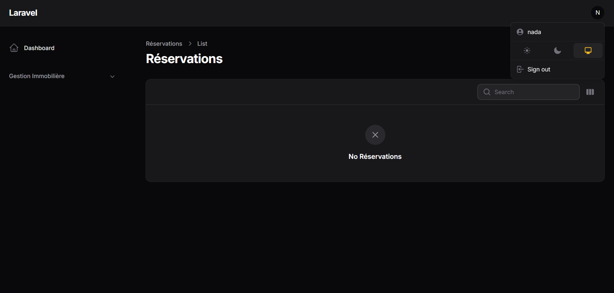
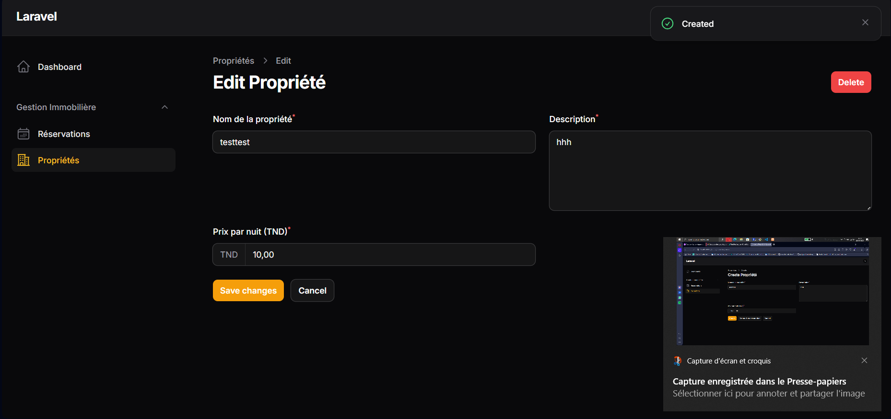

<<<<<<< HEAD
# Application-de-gestion-de-r-servations-immobili-res
 Une  application de gestion de réservations immobilières en utilisant ces technologies :Laravel, Livewire, Filament et TailwindCSS.
=======  

